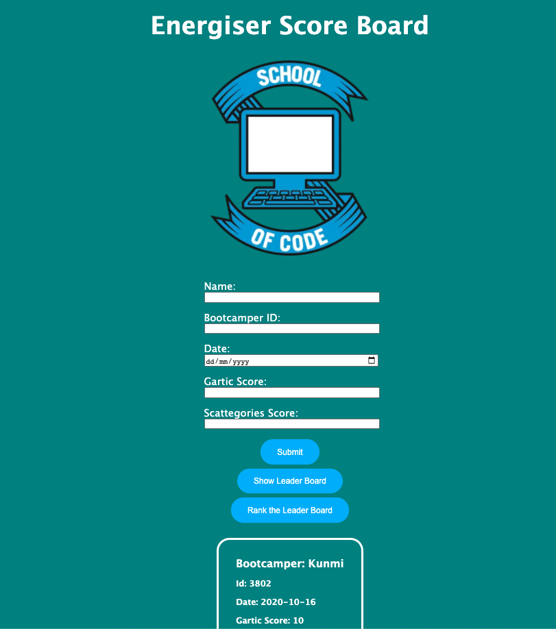

# Energiser Score Tracker

**School of Code - Week 4 Hackathon**

##### October 2020

This hackathon was my first experience building a full stack application using Express and a PostgreSQL database for persistent storage. This score tracker will help coaches and bootcampers keep track of bootcamper scores in our daily energisers. A leaderboard can be retrived from the database and then can be sorted in order of [Gartic](https://gartic.io/) Score.

#### Hackathon Requirements

- Must use a Database for persistent storage.
- Must use the model pattern to allow easy interaction with the data.
- Must use an REST API server to manage requests and serve back data.
- Must have a front end which allows users to at least view the data.

## To Start

Clone the repo as instructed below and install npm modules. You need to start the server to connect to the database.

## Installation

1.  Clone the repo 
    `https://github.com/kumsw/energiser-score-board.git`
2.  Download the required npm modules. 
    `npm i`
3.  Open a terminal and start the server using: 
    ` npm run start`
4.  Open a local version of your `index.html` in the browser, for example:   
    ` /Users/{YOUR INFO}/energiser-score-board/myapp/views/index.html`

## Main learnings:

- Using PostgreSQL and creating a database on Heroku.
- Took time to break down the problem and plan our approach before coding.
- Connected up our backend and frontend.
- Created an Express app.
- Added logic to sorting our data based on the Gartic score.
- I got a better understanding of REST API's in a full stack application.

## Stretch goals:

This is not currently an active project but if I had more time I would look to add this functionality:

- Ability to sort the data on multiple scores.
- Write more models and routes (`DELETE`, `UPDATE`).
